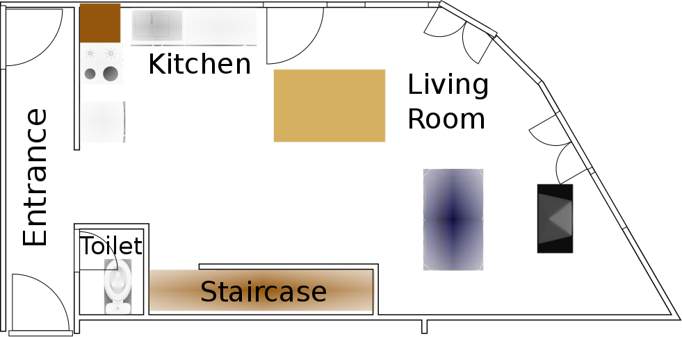
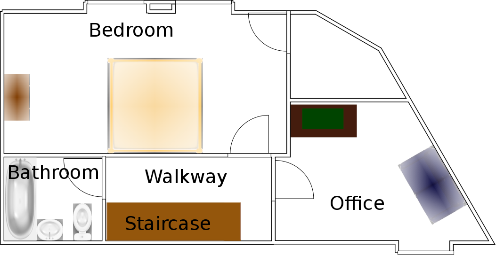
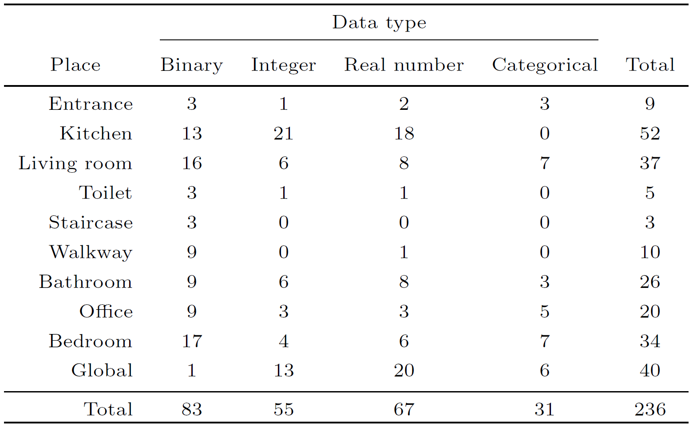

# Orange4Home Analysis

## Table of Contents

- [Dataset Description](#dataset-description)
- [Installation](#installation)
- [Usage](#usage)

## Dataset Description
The Orange4Home dataset comprises roughly 180 hours of recordings of daily living activities of a single occupant, spanning 4 consecutive weeks of workdays. This dataset contains recordings from 236 heterogeneous sensors scattered throughout an apartment and 20 classes of activities labeled accurately *in situ* by the occupant, totaling 493 instances of activities. These characteristics make Orange4Home suitable for evaluating activity recognition algorithms, activity prediction algorithms, and other smart home research problems.

### Apartment Layout

The Amiqual4Home apartment used to collect this dataset has the following layout:

<br>
*Ground floor*


<br>
*First floor*

### Sensors

The Orange4Home dataset contains recordings from 236 data sources. Each data source is either binary, an integer, a real number, or categorical. Data sources are distributed in different places within the apartment:



[**The complete list of data sources can be found here**](orange4home/sensors_localisation.txt) (sources in the “Possibly” section of a place are sensors that are identified as being part of another place but are also at least partially in that place).

### Activities and Routines

Activities were labeled *in situ* by the occupant. The possible activity classes (grouped by the place where they can occur) are:

- **Entrance:** Entering, Leaving
- **Kitchen:** Preparing, Cooking, Washing the dishes
- **Living Room:** Eating, Watching TV, Computing
- **Toilet:** Using the toilet
- **Staircase:** Going up, Going down
- **Bathroom:** Using the sink, Using the toilet, Showering
- **Office:** Computing, Watching TV
- **Bedroom:** Dressing, Reading, Napping
- **All places:** Cleaning

The occupant followed a routine planning for the 4 weeks of the experiment, specifying the sequence of activities to perform (the sequence was strictly followed, while the beginning and end times were loosely followed). [**The full planning given to the occupant can be found here**](orange4home/planning.pdf).


## Installation

### Prerequisites

Ensure you have the following installed:

[Python 3.x](https://www.python.org/downloads/)

### Steps

1. Clone the repository:

    ```bash
    git clone https://github.com/anna-stefani3/orange4home-analysis
    cd orange4home-analysis
    ```

2. Create and activate a virtual environment (optional but recommended):

    ```bash
    python -m venv venv
    source venv/bin/activate  # On Windows use `venv\Scripts\activate`
    ```

3. Install the required packages:

    ```bash
    pip install pandas numpy scikit-learn sklearn-crfsuite imbalanced-learn hmmlearn
    ```

## Usage

### Detailed Usage

To preprocess the Orange4Home dataset and prepare it for analysis, follow these steps:

1. **Run the Main Script**

    Start by running the main script. This will initiate the preprocessing function:

    ```bash
    python main.py
    ```

2. **Choosing Data Source**

    - **Option 1: Use Saved Preprocessed Data**  
      If there is a preprocessed CSV file available, you will be prompted to choose whether to use this saved file.  
      When prompted, enter `1` to read from the saved preprocessed CSV file:

      ```
      Press 1 to Read from saved Preprocessed CSV (o4h_activity_dataframe.csv) File
      ```

    - **Option 2: Process Raw Data**  
      If you do not choose to use the saved file, the script will process the raw CSV data from the specified `filename`.

3. **Data Preprocessing Steps**

    - **Extract Activity Duration Data**: The script will extract activity duration data from the raw dataset.
    - **Clean Sensor Data**: It will clean and prepare the sensor data, resampling it to a 1-minute frequency.
    - **Calculate Motion Count**: Motion count will be calculated from the presence data.
    - **Merge Data**: The cleaned sensor data and motion count data will be merged based on the 'Time' column.
    - **Convert Data Types**: Relevant columns will be converted to float type.
    - **Save Merged Data**: The merged DataFrame will be saved to a CSV file (o4h_activity_dataframe.csv) for future use.

4. **Data Splitting**

    The dataset will be grouped by day and split into training, validation, and testing sets:

    - **Group Data by Day**: The data will be grouped day-wise.
    - **Filter Non-Empty Groups**: Only groups with more than zero rows will be considered.
    - **Split Data**: The grouped data will be split into training, validation, and testing sets.

5. **Optional Feature Additions**

    You will be prompted to add various features to the dataset. Respond with `1` if you wish to add the feature:

    - **Literature-Based Features**: 

      ```
      Enter 1 to Add Literature Based Features
      ```

    - **Time-Based Features**:

      ```
      Enter 1 to Add Time Based Features
      ```

    - **Temporal Sequence Features**:

      ```
      Enter 1 to Add Temporal Sequence
      ```

6. **Extract Features and Labels**

    The features and labels will be extracted from the training, validation, and testing DataFrames.

7. **Output**

    After preprocessing completes, we will get these datasets(Dataframes)

    ```bash
    X_train, X_valid, X_test, y_train, y_valid, y_test
    ```

### Example

Here's an example command sequence to run the preprocessing and respond to prompts:

```bash
python main.py
Press 1 to Read from saved Preprocessed CSV File
Press 1 to Add Literature Based Features
Press 1 to Add Temporal Sequence
```

8. **Experimentation**

    Now for each experiement (Method) user will be asked to press "1" and then press "Enter" to excute that method else simply press "Enter" to Skip that method.

```bash
Press 1 to apply_decision_tree_on_balanced_data
Press 1 to apply_decision_tree_to_classify_activity_directly
Press 1 to apply_decision_tree_to_classify_location_then_activity
Press 1 to apply_multiple_binary_decision_tree_classifiers_per_activity
Press 1 to apply_rule_based_system_to_classify_location_then_activity
```


## Acknowledgments

### Datasets

- **Orange4Home Dataset**
  - **Description**: 
  A dataset of routine daily activities in an instrumented home.

  - **Citation**: 
  Julien Cumin, Grégoire Lefebvre, Fano Ramparany, and James L. Crowley. 
  "A Dataset of Routine Daily Activities in an Instrumented Home". 
  In 11th International Conference on Ubiquitous Computing and Ambient Intelligence (UCAmI), 2017. 
  [Link to publication](https://hal.science/hal-01639673)
